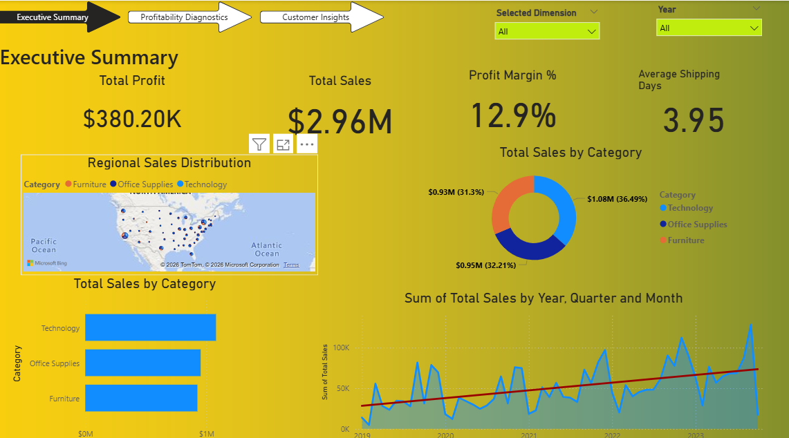
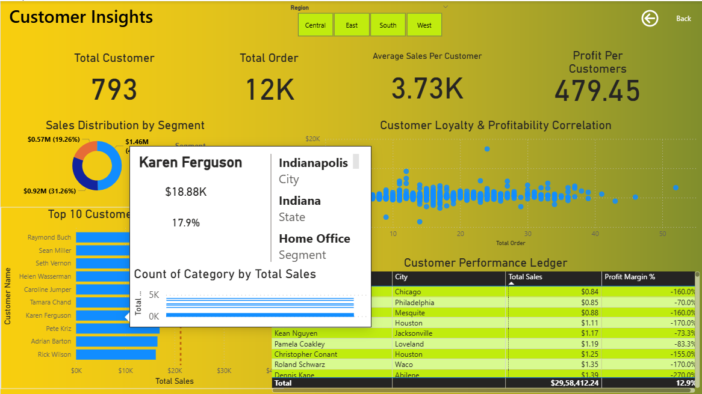
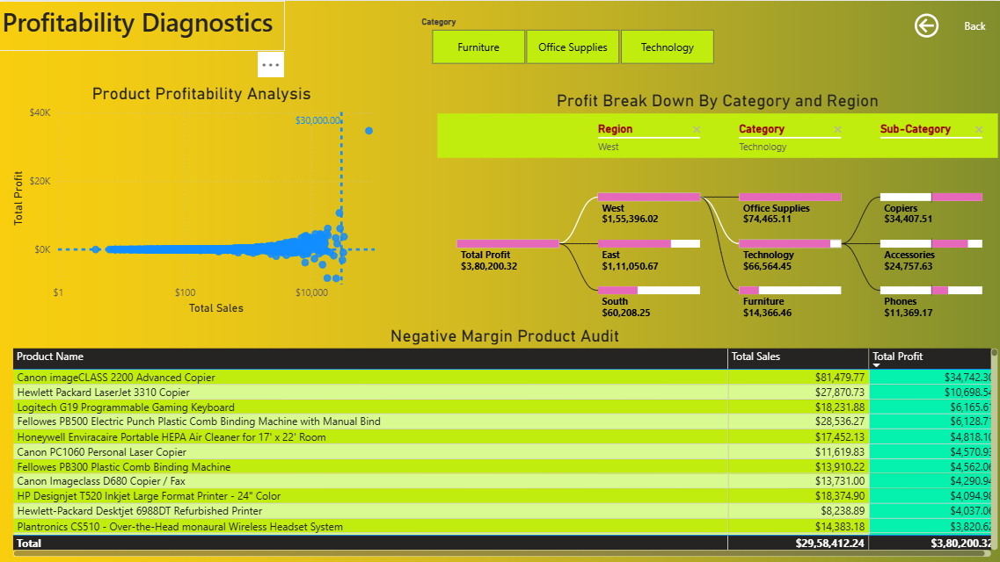

# Sales Analytics Dashboard | SQL Server + Power BI

## Project Overview
This project focuses on analyzing sales performance using SQL Server and Power BI.

The dataset was imported from Excel into SQL Server where data cleaning and transformation were performed. A Star Schema data model was created for efficient reporting and analysis.

Power BI was used to build an interactive dashboard with DAX measures, KPIs, filters, and parameter-based analysis.

---

## Tools & Technologies Used
- Microsoft Excel
- MS SQL Server
- Power BI
- SQL
- DAX

---

## Project Workflow
1. Imported raw Excel dataset into SQL Server
2. Performed data cleaning and transformation using SQL queries
3. Created Star Schema data model
4. Connected SQL Server with Power BI
5. Created DAX measures and calculated metrics
6. Built parameter-based interactive analysis
7. Designed interactive dashboard and reports

---

## Dashboard Features
- KPI Cards
- Sales & Profit Analysis
- Customer Insights
- Profitability Diagnostics
- DAX Measures
- Dynamic Parameters
- Interactive Filters and Slicers

---

## Data Modeling
Implemented Star Schema Architecture including:
- FactSales
- DimCustomer
- DimProduct
- DimGeography
- DimDate

---

## Project Screenshots

### Executive Summary

### Customer Insights

### Profitability Diagnostics

---

## Key Learnings
- SQL data cleaning techniques
- Star schema data modeling
- DAX calculations and measures
- Interactive dashboard development
- Business data analysis and reporting

---

## Author
Shivam Singh
